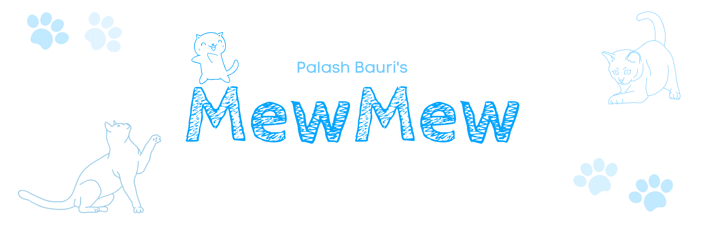

[](http://makeapullrequest.com)
[](https://www.firsttimersonly.com/)

**Give a Star 🌟 to this project to support this project**

#### /ᐠ｡ꞈ｡ᐟ\ MewMew 🐱 is an Esoteric `Just for Fun` programming language. You can program in cats' language with MewMew. Have Fun!

## 🎉 Get Started
#### 😸 Integers
There's no concept of numbers (eg. 1 2 3 4 100) in MewMew, instead we use `mew`s. 1 `mew` is equal to 1 , therefor `mewmew` = 2 , `mewmewmew` = 3 , `mewmewmewmewmewmewmewmewmewmew` = 10 and `mew-mew` = 0. (You got the Idea, right)

#### 😸 Operators
**MewMew supports a few types of operators =>**
- `+` -> Addition
* `-` -> Subtraction
* `*` -> Multiplication
* `/` -> Division
* `**` -> Power
* `~` -> Absolute Value
* `-` -> Unary Minus
* `>` -> Greater than
* `>=` -> Greater than equal to
* `<` -> Less than
* `<=` -> Less than equal to
* `==` -> Is Equal to
* `!=` -> Not Equal to
* `&` -> And
* `|` -> Or
* `%` -> Modulus (Remainder)

#### 😸 Identifiers
MewMew identifiers must start with an `m` and can contain zero or more consecutive `_` and `w`. `e` cannot be used , because the interpreter can confuse it with a mew number.

#### 😸 Assignment
`ID = Expression`

IDs will follow the rules of identifiers (above mentioned)

#### 😸 Print aka. *Meow Say*
There's no keyword , to print we use the `::` symbol, for example
`::mewmew + mewmew` outputs `4`

#### 😸 If
`CONDITION ? TRUTH_BODY ;`

If statement of mewmew is very similar to ternary expression of C/C++.


#### 😸 If Else
`CONDITION ? TRUTH_BODY : ELSE_BODY ;`

#### 😸 Repeat Loop aka. *Meow Loop*
`@TIMES : BODY ;`

Where `TIMES` can be any mew number , and the `BODY` will be executed `TIMES` times.

#### 😸 Scratch Functions
`#MEWNUMBER` (The '#' can be 1 to 5 consecutive times )
*   1 `#` calculates square root of the expression
*   2 `#` returns 2 times the given expression
*   3 `#` returns 5 times the given expression
*   4 `#` returns 10 times the given expression
*   5 `#` returns 100 times the given expression

#### 😸 Comments
`//`

To write a comment , start the sentence with `//`

## 🎁 Example Programs:
(Two Examples are provided in the repo)

```
//Addition

m = mewmew + mewmewmew;
::m;

OUTPUT: 5
```

```
// Print All Numbers Divisible by 2 under 100
m = mew;
@#####(mew):
    m % mewmew == mew - mew ? ::m;;
    m = m+mew;

;
```


## 📑 NOTEs:
*  MewMew is an esoteric language , it was never intended to be used for mainstream programming.
*  MewMew is only tested on Linux device (Ubuntu 18.04 x86_64). Building on Windows or MacOS should not be difficult , Please let me know , if you build it on either Windows or MacOs.

## 🔨 Building Yourself
#### 🔩 Required
- ANTLR4 JAR
- ANTLR4 (C++) RUNTIME
- GCC/G++
- CMake

#### 🔧 How to Build
- Download & Setup ANTLR4 JAR (JAVA Runtime is Required to run ANTLR4)
- Download ANTLR4 C++ Runtime , compile and setup
- Fork , Clone this Repository
- `mkdir build && cd build`
- `cmake ..`
- If Things are good. You'll have a executable binary file called **mewmew**

